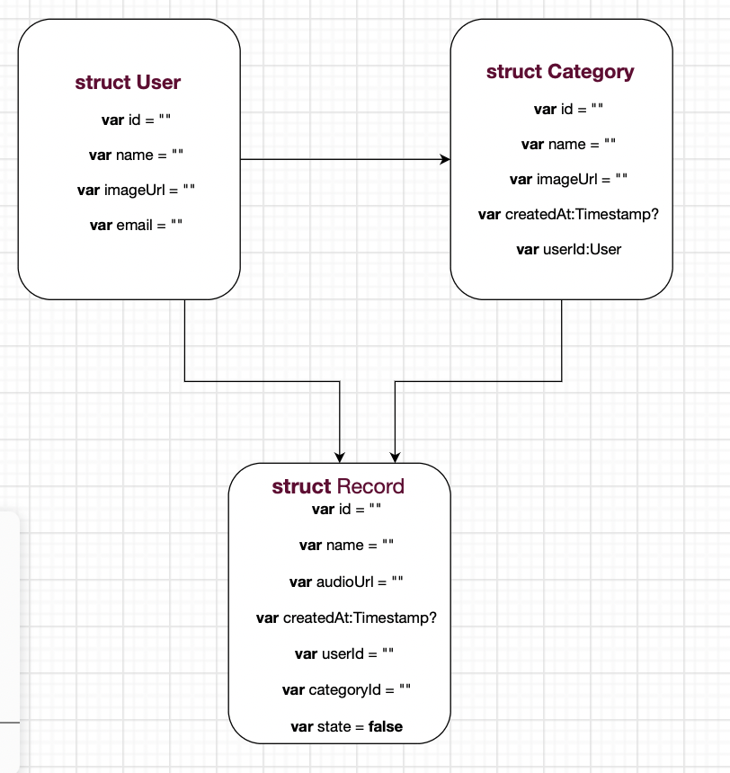

# BeProductive

## Description
- An application to organize tasks and increase productivity, 
 by using audio recordings, to facilitate their recording and preservation

## Demo

## user Stories 

- As user I can register
- As user I can sign in
- As user I can add new lists
- As user I can delete lists
- As user I can add new task by voice notes
- As user I can update the title of the audio and delete it 
- As user I can start countdown timer to focus on any thing

## Framework

- UIKit
- Firebase
- Foundation
- IQKeyboardManagerSwift
- AVFoundation

## ERD

## Wireframe

